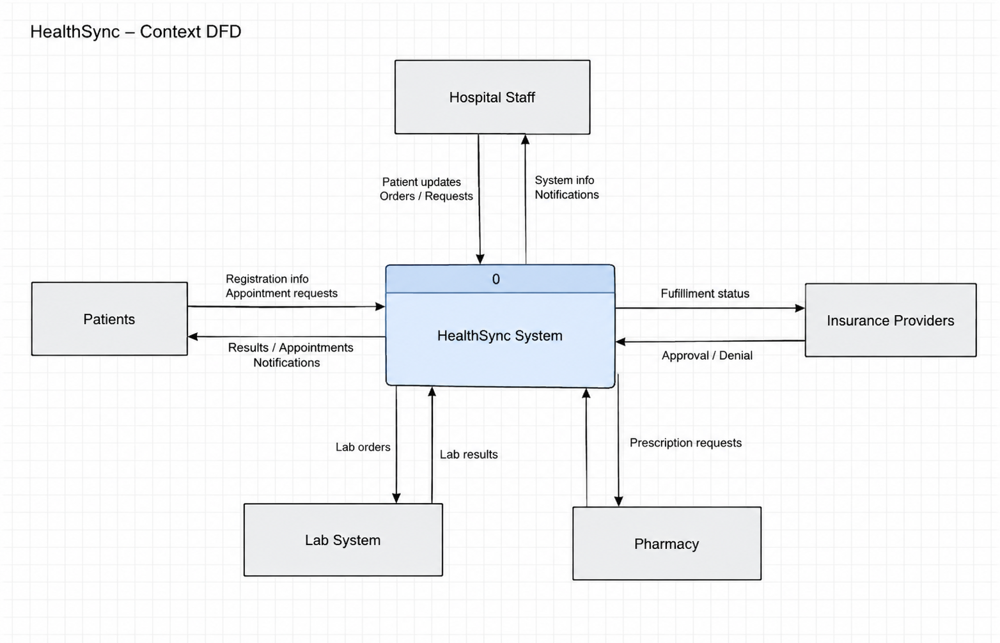
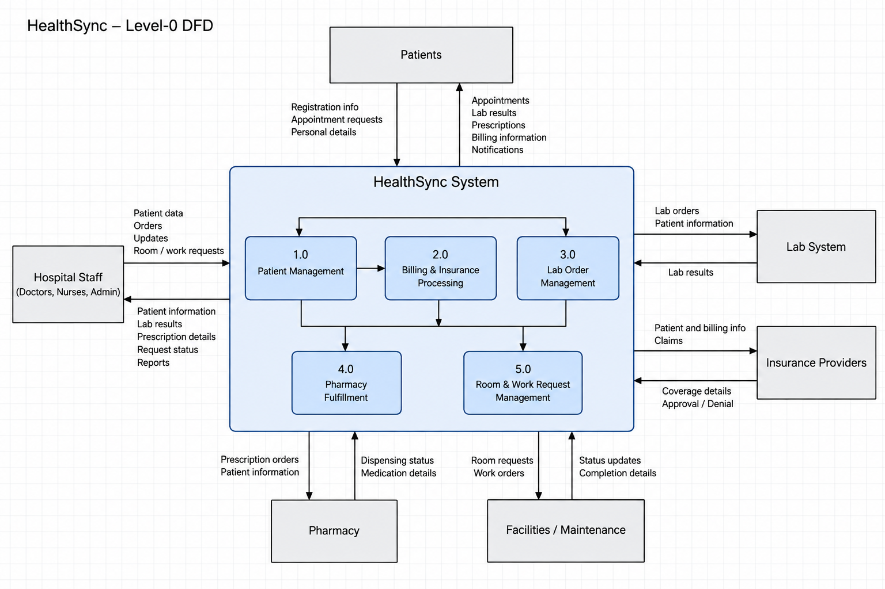
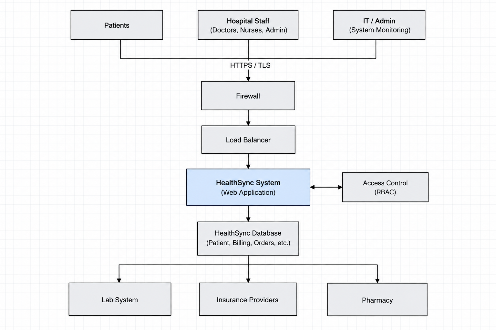

# HealthSync Information System

HealthSync is a healthcare information system I am designing as a case study for a fictional hospital. The goal is to organize the hospital's main processes in one system while keeping patient information secure and making sure each type of user only has access to what they need.

The project started with a healthcare system scenario I previously worked on in school. I am rebuilding and expanding the idea independently for my portfolio, with a stronger focus on system design, security, and documentation.

## What HealthSync Handles

The system is designed around five main areas:

- Patient management
- Billing and insurance
- Lab orders and results
- Prescriptions and pharmacy requests
- Room and maintenance requests

It also needs to communicate with outside services such as insurance providers, lab systems, and pharmacies.

## System Context

This diagram shows how HealthSync exchanges information with the main users and outside services connected to the system.

### Level-0 Data Flow Diagram

The Level-0 DFD breaks HealthSync into its main processes and shows how information moves between the system, hospital users, and outside services.

## System Architecture

HealthSync uses a simple layered design to separate users, security controls, the application, and stored data. Users connect through HTTPS/TLS, with traffic passing through the firewall and load balancer before reaching the HealthSync application.

Role-based access control (RBAC) determines what each user can access. The application stores patient, billing, and operational data in the HealthSync database and connects with outside services such as lab systems, insurance providers, and pharmacies.

## Users

HealthSync has different types of users with different responsibilities:

**Patients**
- View appointments and health information
- Access lab results
- View prescriptions
- Use the patient portal

**Doctors and Nurses**
- Access patient information
- Review lab results
- Manage clinical information
- Submit orders and updates

**Administrative Staff**
- Register patients
- Schedule appointments
- Handle billing and insurance information
- Manage administrative workflows

**IT / System Administrators**
- Manage system access
- Maintain the environment
- Review system and security logs
- Support users and system operations

## Security

Healthcare information should not be available to every user just because they have access to the system. HealthSync uses role-based access so permissions can be separated between patients, clinical staff, administrative staff, and system administrators.

The design also considers:

- Encrypted communication
- Network segmentation
- Firewall protection
- Authentication and access control
- Audit logging
- Security monitoring
- Protection of patient information

## System Design

I am documenting the system from both a business and technical perspective. This includes:

- System requirements
- System boundaries
- Data Flow Diagrams (DFDs)
- User roles and permissions
- Interface designs
- System architecture
- Security controls
- Implementation planning
- Testing
- Maintenance and monitoring

## Project Files

The diagrams and documentation below cover the main parts of the HealthSync design.

### Diagrams

- **Context DFD** — Shows the users and outside systems that exchange information with HealthSync
- **Level-0 DFD** — Breaks HealthSync into its five main processes and shows how data moves through the system
- **System Architecture** — Shows the path from users through security controls to the application, database, and external services

### Documentation

- [Access Control](docs/access-control.md) — User roles, permissions, and the RBAC approach
- [Implementation and Testing Plan](docs/implementation-testing.md) — Environment setup, data migration, testing, rollout, and ongoing support

## What I Worked On

For this portfolio version, I rebuilt the HealthSync idea as an independent systems design case study. I focused on organizing the system requirements, data flows, user access, security, system architecture, and implementation plan into one project that explains how the proposed system would work.

HealthSync is a design case study and not a deployed healthcare application.
